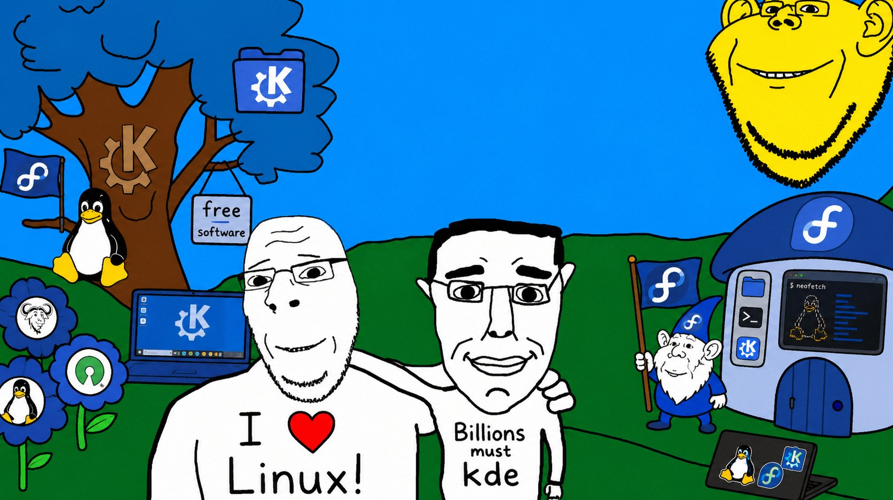

#  Agate

[](https://gitlab.com/fpsys/agate/-/pipelines)
[](https://artifacthub.io/packages/search?repo=agate)
[](https://artifacthub.io/packages/search?repo=agate-alt)

**Website: [os.fpt.icu](https://os.fpt.icu)**

## Overview

Agate is a Fedora Bazzite-based atomic image built with [BlueBuild](https://blue-build.org/). It is a personal daily driver, tuned for one workflow, with custom branding and a curated app set.

**Warning:** this image is for personal use. The source is shared for reference only, and some customizations may not fit your setup.

Base image: `ghcr.io/ublue-os/bazzite-nvidia-open:latest` (KDE Plasma, NVIDIA).

## What It Does

*   Stays atomic and rollback-friendly.
*   Adds personal branding, wallpapers, icons, and KDE tweaks.
*   Enables `nordvpnd`, `tailscaled`, `dnscrypt-proxy`, `podman.socket`, `docker.socket`, `input-remapper`, and `uupd.timer`.
*   Ships curated RPMs and Flatpaks for development, gaming, media, and daily work.
*   Adds a Niri Wayland session alongside Plasma, with DankMaterialShell, cava, khal, and matugen.
*   Includes `ujust` tasks for dotfiles, theming, Nix/Devbox, Spicetify, GPG, and YubiKey/LUKS setup.

## Recipes

| File | Purpose |
|---|---|
| `recipe.yml` | Builds the `latest` channel. |
| `recipe-testing.yml` | Same image on the `testing` channel of the base image. |
| `common-modules.yml` | The shared module list; both channels include it. |
| `common.yml` | Kargs, initramfs, and cosign signing. Required, and must stay last. |
| `common-packages.yml` | Extra COPRs, repo files, RPMs, and services. |
| `common-flatpaks.yml` | System-wide Flatpaks. |
| `common-desktop-dev.yml` | Desktop and development tooling, Docker, virtualization. |
| `common-development.yml` | Nix setup and dev `ujust` tasks. |
| `common-windowmanager.yml` | Niri, DankMaterialShell, and theming packages. |
| `common-theming.yml` | Nerd fonts and theme tasks. |
| `common-dotfiles.yml` | chezmoi integration and dotfile tasks. |

The two recipes differ only in `image-version`, `alt-tags`, and the `AGATE_CHANNEL` passed to `branding.sh`.

Editing a recipe has no effect until you rebuild and rebase.

## Building from Source

Requires [Podman](https://podman.io/) and [Just](https://github.com/casey/just).

```bash
git clone git@gitlab.com:fpsys/agate.git
cd agate
just build
```

Other build tasks:

| Command | Description |
|---|---|
| `just build` | Build the container image. |
| `just validate` | Validate the BlueBuild recipe. |
| `just generate` | Write a `Containerfile` for inspection. |
| `just prune` | Remove cached BlueBuild artifacts. |
| `just format-justfiles` | Format `files/justfiles/*.just`. |
| `just build-installer` | Build a bootable installer ISO. Requires `sudo`. |
| `just build-live-iso` | Build a live ISO via [titanoboa](https://github.com/ublue-os/titanoboa). Requires `sudo`. |

The ISO recipes expect a local `installer/` checkout (titanoboa provides it); they are not part of the committed tree.

## How to Use

Switch an existing `bootc`-compatible system to this image:

```bash
sudo rpm-ostree rebase ostree-unverified-registry:quay.io/fptbb/agate:latest
```

GitHub Container Registry works as a mirror:

```bash
sudo rpm-ostree rebase ostree-unverified-registry:ghcr.io/fptbb/agate:latest
```

Reboot afterwards. Check status any time with `sudo bootc status`.

## Helper Tasks

After rebasing, `ujust --list` shows every available task. The main groups:

*   `dotfiles-*` — bootstrap, sync, apply, diff, and push your dotfiles.
*   `agate-devbox` — install Devbox. Nix ships in the image already.
*   `agate-manage-themes` — install Catppuccin, Kora, and PlasMusic.
*   `agate-spicetify` — patch Spotify and install Spicetify Marketplace.
*   `agate-luks-setup`, `agate-luks-remove`, `agate-kde-setup` — manage YubiKey-backed LUKS and authentication.
*   `agate-gpg-*`, `agate-sign`, `agate-encrypt`, `agate-decrypt` — GPG and YubiKey signing helpers.
*   `malachite`, `container`, `toggle-services`, `toggle-tor` — distrobox, container, and service management.

## Verification

Images are signed with [cosign](https://github.com/sigstore/cosign). The public key is published at `https://os.fpt.icu/cosign.pub` and in this repo as [`cosign.pub`](cosign.pub).

```bash
cosign verify --key cosign.pub quay.io/fptbb/agate
```

## Name Meaning

Many Fedora Atomic Desktops are named after minerals and rocks—often silicates like kinoite or onyx (and even bazzite), evoking the durable, crystalline foundations of these immutable systems. In that spirit, I've named this Bazzite-based image after **Red Fox Agate**, a rare variety of chalcedony quartz whose vibrant orange-red bands, streaked with white, mimic the fur of a red fox.

Sourced exclusively from ancient volcanic geodes in Patagonia, Argentina (notably the Cerro Cristal region near Perito Moreno), Red Fox Agate was first discovered in 1997. Its botryoidal hematite inclusions create that signature "foxy" pattern, with a Mohs hardness of 6.5–7 making it ideal for polished cabochons, jewelry, or display specimens.

For more on this gem: [Red Fox Agate Overview](https://www.geologyin.com/2023/11/red-fox-agate.html)

## Acknowledgements

This project is made possible by the work of the open-source community. Special thanks to:

*   The [Universal Blue](https://universal-blue.org/) project and all its contributors.
*   The [BlueBuild](https://blue-build.org/) project and all its contributors.
*   Inspiration from other custom OS projects like [VeneOS](https://github.com/Venefilyn/veneos), [amyos](https://github.com/astrovm/amyos), and [m2os](https://github.com/m2Giles/m2os).
* And **this community**:
    

## License

Licensed under the Mozilla Public License 2.0. See [LICENSE](LICENSE).